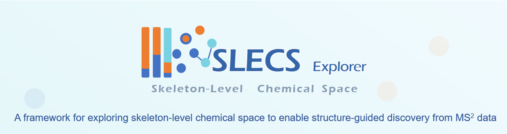

# SLECS Explorer





Description
-----------
SLECS Explorer is a framework for constructing and exploring Skeleton-Level Chemical Space (SLECS) from tandem mass spectrometry (MS/MS) data. SLECS is a feature-structured representation of MS/MS data derived from non-negative matrix factorization (NMF), in which MS/MS spectra are reorganized according to fragment feature patterns extracted through NMF decomposition to reveal underlying skeleton-level connections among metabolites. This skeleton-level chemical space facilitates the prioritization of structurally distinct regions and supports structure-guided discovery of novel molecular scaffolds.

This repository provides the source code, demonstration datasets, and web interface associated with the SLECS workflow. Representative input datasets and source code implementing the key steps of the workflow are included in this repository.

The complete datasets supporting this study, including raw MS/MS files, processed results, and figure source data required for reproducing the published analyses, are publicly available through Zenodo:

**https://doi.org/10.5281/zenodo.20700190**


## Directory Structure

```plaintext
SLECS Explorer/
├── README.md       
├── requirements.txt
├── docs/         
└── demo/            
``` 

## DATA
The `input/` folder contains representative datasets used to demonstrate the SLECS workflow, including:

* Raw MS/MS spectra (`*.mgf`);
* Pre-filtered MS/MS spectra (`*.mgf`);
* Molecular networking files generated through the GNPS-FBMN workflow, containing similarity information between connected nodes (`*.graphml`).

These datasets can be used together with the scripts provided in this repository to reproduce the construction of fragment-feature matrices and subsequent NMF analyses.

The `demo/` folder provides a pre-generated optimized fragment-feature matrix for rapid testing of the SLECS workflow.


## Contact

For questions regarding the dataset or workflow,please contact shuchenlan@simm.ac.cn(Chenlan Shu) or yuzhuohao@simm.ac.cn(Zhuohao Yu)
